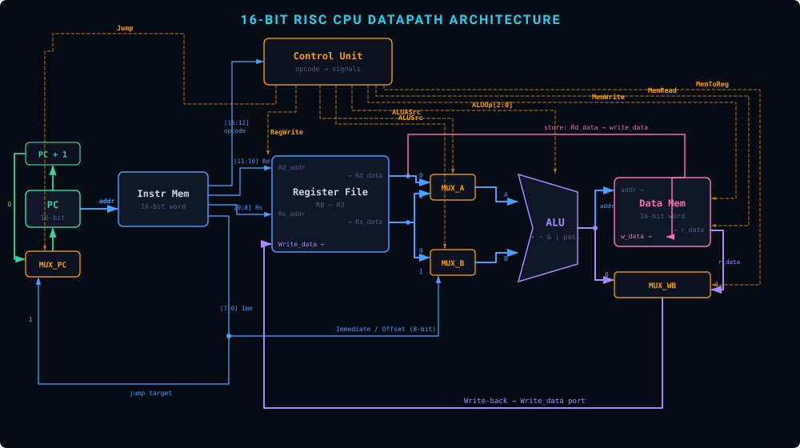
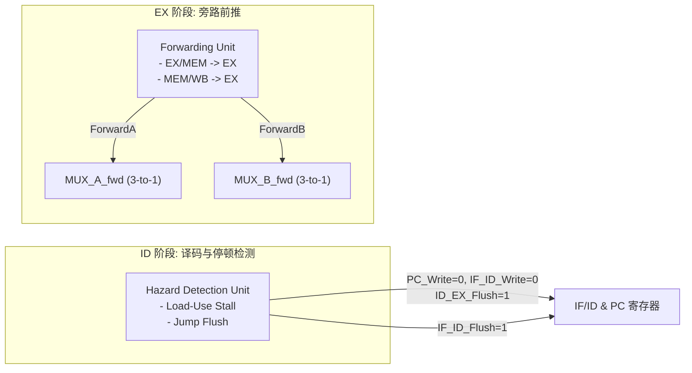
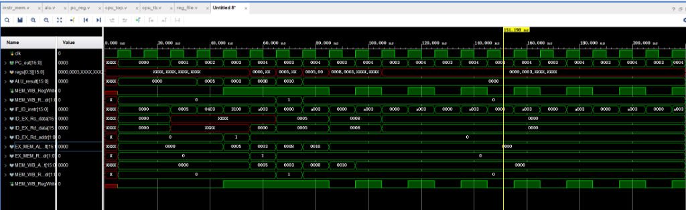

<div align="center">

# 🚀 16-Bit RISC 5-Stage Pipelined CPU

**A modular, hazard-free 16-bit RISC Pipelined Processor implemented in Verilog HDL & verified on Xilinx Zynq FPGA**

[](https://en.wikipedia.org/wiki/Verilog)
[]()
[]()
[]()
[-informational.svg)]()
[](LICENSE)

[Project Highlights](#-project-highlights) • [Architecture Overview](#-architecture-overview) • [ISA Specification](#-instruction-set-architecture-isa) • [Hazard Handling](#-hazard-handling-mechanisms) • [FPGA Implementation](#-fpga-implementation--verification) • [Evolution Journey](#-evolution-journey-v5--final) • [Quick Start](#-quick-start--simulation)

</div>

---

## 📚 Academic Context & Reference

* **Course**: *Digital Logical Design and Application* (UESTC - University of Electronic Science and Technology of China)
* **Team (Team 202602)**:
  * **徐瑞成 (Xu Ruicheng)**: Controller design, Hazard Detection Unit & Testbench architecture
  * **李泊良 (Li Boliang)**: Datapath design, ALU & Register File implementation
  * **刘颢诚 (Liu Haocheng)**: Pipeline register integration, FPGA synthesis & Board-level testing
* **Core Reference**:
  > **David A. Patterson and John L. Hennessy**, *Computer Organization and Design RISC-V Edition: The Hardware Software Interface*, The Morgan Kaufmann Series in Computer Architecture and Design.

---

## 📖 Project Highlights

本项目实现了一个基于经典 **5 级流水线（IF-ID-EX-MEM-WB）** 的 **16-bit RISC 处理器**。体系结构设计紧密遵循 Patterson & Hennessy 经典流水线模型，完整历经了数据冒险前推（Forwarding）、Load-Use 气泡停顿（HDU Bubble Stall）、连续访存冲突权衡，以及控制冒险跳转冲刷（Jump Flush）的演进周期，并成功部署于 **EES-331 FPGA 开发板（Xilinx Zynq XC7Z020）**。

* **完整 5 级流水线**: Instruction Fetch (IF) $\to$ Instruction Decode (ID) $\to$ Execute (EX) $\to$ Memory Access (MEM) $\to$ Write Back (WB).
* **硬件级冒险消除机制 (Zero-Overhead RAW Resolution)**:
  * **Forwarding Unit (EX)**: 针对 RAW 数据依赖，提供 `EX/MEM` 与 `MEM/WB` 到 EX 阶段的双路 3-to-1 前推。
  * **Hazard Detection Unit (ID)**: 针对 Load-Use 冒险，自动冻结 PC 与 IF/ID 寄存器，并注入 1 周期气泡（Bubble）。
  * **Jump Branch Flush (ID/IF)**: 针对无条件跳转 `jump`，实现 `Flush > Write` 优先级的流水线冲刷。
* **物理 FPGA 板级验证与高可观测性**:
  * 运行于 **100 MHz** 系统时钟（引脚 `M19`），无 Setup/Hold 时序违例。
  * 专设板载 8 个 LED 实时映射寄存器状态（`led[7:4] = R0[3:0]`, `led[3:0] = R1[3:0]`），实现高度可观测的硬件级验证。

---

## 🏛 Architecture Overview

<div align="center">
  
  <p><i>Figure 1: 16-Bit RISC CPU Datapath and Control Flow Diagram</i></p>
</div>

### 五级流水线职责划分

| 流水级 | 核心组件 | 主要职责 |
| :--- | :--- | :--- |
| **IF** | `PC_Reg`, `Adder (+1)`, `Instr_Mem`, `MUX_PC` | 根据 PC 取指，支持顺序递增与跳转目标装载。 |
| **ID** | `Reg_File`, `Control_Unit`, `HDU` | 16-bit 指令译码，读出两路源操作数，检测 Load-Use 冒险与 Jump 冲刷信号。 |
| **EX** | `Forwarding_Unit`, `MUX_fwd`, `ALU`, `MUX_Imm` | 两级 MUX 级联选通（前推仲裁 + 立即数选择），执行算术/逻辑/有效地址计算。 |
| **MEM** | `Data_Mem` | 依据 ALU 计算的有效地址读写数据内存。 |
| **WB** | `MUX_WB` | 仲裁 ALU 计算结果或 Data Mem 读出数据，写回目标寄存器，并回传至 Forwarding Unit。 |

---

## 📜 Instruction Set Architecture (ISA)

### 指令格式 (16-Bit Fixed Length)

```
 15       12 11     10 9       8 7                            0
+-----------+---------+---------+------------------------------+
|   Opcode  |   Rd    |   Rs    |          Imm / Offset        |
|  (4 bits) | (2 bits)| (2 bits)|            (8 bits)          |
+-----------+---------+---------+------------------------------+
```

* **Opcode [15:12]**: 4 位操作码。
* **Rd [11:10]**: 2 位目的寄存器 / 第一操作数寄存器编号（`R0` ~ `R3`）。
* **Rs [9:8]**: 2 位源寄存器编号（`R0` ~ `R3`）。
* **Imm/Offset [7:0]**: 8 位立即数或访存偏移量。

### 指令集与控制信号真值表

| Opcode | 汇编助记符 | 指令功能 | ALUASrc | ALUSrc | ALUOp | MemW | MemR | Mem2Reg | RegW | Jump |
| :---: | :--- | :--- | :---: | :---: | :---: | :---: | :---: | :---: | :---: | :---: |
| `0000` | `mov Rd, #imm` | $Rd \leftarrow Imm$ | 0 | 1 | PASS | 0 | 0 | 0 | 1 | 0 |
| `0001` | `mov Rd, Rs` | $Rd \leftarrow Rs$ | 1 | 0 | PASS | 0 | 0 | 0 | 1 | 0 |
| `0010` | `add Rd, #imm` | $Rd \leftarrow Rd + Imm$ | 0 | 1 | ADD | 0 | 0 | 0 | 1 | 0 |
| `0011` | `add Rd, Rs` | $Rd \leftarrow Rd + Rs$ | 0 | 0 | ADD | 0 | 0 | 0 | 1 | 0 |
| `0101` | `sub Rd, Rs` | $Rd \leftarrow Rd - Rs$ | 0 | 0 | SUB | 0 | 0 | 0 | 1 | 0 |
| `0111` | `and Rd, Rs` | $Rd \leftarrow Rd \ \& \ Rs$ | 0 | 0 | AND | 0 | 0 | 0 | 1 | 0 |
| `1001` | `or Rd, Rs` | $Rd \leftarrow Rd \ \| \ Rs$ | 0 | 0 | OR | 0 | 0 | 0 | 1 | 0 |
| `1010` | `jump #imm` | $PC \leftarrow Imm$ | x | x | x | 0 | 0 | x | 0 | 1 |
| `1100` | `ld Rd, Rs, #off` | $Rd \leftarrow \text{Mem}[Rs + off]$ | 1 | 1 | ADD | 0 | 1 | 1 | 1 | 0 |
| `1101` | `st Rd, Rs, #off` | $\text{Mem}[Rs + off] \leftarrow Rd$ | 1 | 1 | ADD | 1 | 0 | x | 0 | 0 |

---

## ⚡ Hazard Handling Mechanisms



### 1. Forwarding Unit (EX 阶段旁路前推)
* **解决目标**: 算术/逻辑指令连续执行时的 RAW (Read-After-Write) 数据依赖。
* **对称比较与优先级**:
  * `ForwardA`: 比较 `ID/EX.Rd_addr` 是否匹配 `EX/MEM.Rd_addr` 或 `MEM/WB.Rd_addr`。
  * `ForwardB`: 比较 `ID/EX.Rs_addr` 是否匹配 `EX/MEM.Rd_addr` 或 `MEM/WB.Rd_addr`。
  * **优先级**: `EX/MEM` 阶段结果优先于 `MEM/WB` 阶段。
* **两级级联结构**:
  * 采用第一级 3-to-1 前推选择 MUX + 第二级 2-to-1 立即数选择 MUX。当指令选择立即数时，前推结果自然被正交忽略，极大简化了控制复杂度。

### 2. Hazard Detection Unit (ID 阶段 Load-Use 冒险检测)
* **解决目标**: `ld` 指令的数据必须在 MEM 阶段才能产生，无法在下一周期直接前推至 EX 阶段。
* **检测条件**:
  $$\text{ID/EX.MemRead} == 1 \quad\land\quad (\text{ID/EX.Rd\_addr} == \text{IF/ID.Rd\_addr} \;\lor\; \text{ID/EX.Rd\_addr} == \text{IF/ID.Rs\_addr})$$
* **动作**:
  1. 冻结 PC (`PC_Write = 0`)
  2. 冻结 IF/ID 寄存器 (`IF_ID_Write = 0`)
  3. 向 ID/EX 寄存器注入气泡 (`ID_EX_Flush = 1`，控制信号清零)

### 3. Control Hazard (Jump 指令流水线冲刷)
* **解决目标**: 跳转发生时，流水线已预取了后续错误指令。
* **三步协同机制**:
  1. **CU $\to$ HDU**: 译码出 `jump` 时拉高 `Jump` 信号。
  2. **HDU $\to$ IF/ID**: 产生 `IF_ID_Flush` 冲刷信号。
  3. **IF/ID 优先级重构**: $\text{Priority}: \text{Flush} > \text{Write}$。Flush 为 1 时无条件写零（替换为 NOP），彻底消除分支延迟槽污染。

---

## 🛠 FPGA Implementation & Verification

### 1. 硬件平台与引脚约束 (EES-331 Board)
* **FPGA 芯片**: Xilinx Zynq-7000 XC7Z020-2CLG400I
* **系统时钟**: 100 MHz (Pin `M19`)，单时钟驱动全流水线，时序分析无违例。
* **复位按键处理**: 板载按键 S1 带有 3.3V 上拉电阻（默认高电平，按下为低电平），在 `cpu_top` 顶层统一进行单点极性取反 `rst_n = ~rst`。
* **LED 硬件可观测性**: 顶层将 `led[7:0]` 映射为 `{R0[3:0], R1[3:0]}`，直接在物理板卡上实时显示两个关键通用寄存器的数值。

### 2. 核心冒险测试集与上板验证结果

| 测试用例 | 汇编测试指令序列 | 验证机制 | 仿真与 FPGA 硬件结果 |
| :--- | :--- | :--- | :--- |
| **Forwarding (RAW)** | `add R0, #3`<br/>`add R0, #4` | EX 阶段旁路前推（无停顿） | **$R0 = 7$**，ALU 直接获取最新计算值 |
| **Load-Use Stall** | `st R0, R1, #0`<br/>`ld R2, R1, #0`<br/>`mov R3, #1`<br/>`add R2, R3` | HDU 注入 1-Cycle Bubble | **$R2$ 匹配预期内存读出值**，时序完美同步 |
| **Jump Flush** | `mov R0, #5`<br/>`jmp 3`<br/>`mov R0, #99`<br/>`mov R1, #7` | IF/ID 寄存器硬件冲刷 (Flush) | **$R0 = 5, R1 = 7$**（`mov R0,#99` 被冲刷为 NOP，LED 实时同步显示一致） |

### 3. Vivado 行为仿真波形

<div align="center">
  
  <p><i>Figure 2: Cycle-accurate Pipeline Execution Waveform in Vivado</i></p>
</div>

---

## 📂 Project Structure

```
.
├── README.md                      # 项目主文档 (Architecture, ISA, FPGA, Guide)
├── LICENSE                        # MIT License
├── fpga/
│   └── ees331_pins.xdc            # Xilinx Vivado 引脚与时钟物理约束文件
├── docs/
│   ├── datapath_v5.html           # 交互式数据通路及指令集说明页面
│   ├── datapath_architecture.svg  # 高清矢量架构通路图
│   ├── waveform_simulation.png    # Vivado 仿真波形截图
│   └── architecture_evolution.md  # 详细架构演进与设计权衡报告
├── rtl/
│   ├── cpu_top.v                  # 顶层集成模块 (IF-ID-EX-MEM-WB 5级流水线集成)
│   ├── pc_reg.v                   # 带使能端的程序计数器
│   ├── instr_mem.v                # 指令存储器 (ROM/RAM)
│   ├── reg_file.v                 # 4x16-bit 寄存器堆 (双读单写, 包含 R0/R1 物理端口)
│   ├── control_unit.v             # 主控制单元 (译码生成控制总线)
│   ├── alu.v                      # 16-bit 算术逻辑单元
│   ├── data_mem.v                 # 数据存储器 (RAM)
│   ├── hazard_detection_unit.v    # 冒险检测单元 (Load-Use Stall & Flush)
│   ├── forwarding_unit.v          # 前推旁路单元 (EX/MEM, MEM/WB -> EX)
│   └── pipeline_regs/
│       ├── if_id_reg.v            # IF/ID 流水线寄存器 (Flush > Write)
│       ├── id_ex_reg.v            # ID/EX 流水线寄存器 (Bubble 清零)
│       ├── ex_mem_reg.v           # EX/MEM 流水线寄存器
│       └── mem_wb_reg.v           # MEM/WB 流水线寄存器
├── sim/
│   └── cpu_tb.v                   # 自动化仿真激励文件 ($dumpfile + 自检)
└── scripts/
    └── run_sim.sh                 # Icarus Verilog 快速编译与运行脚本
```

---

## 🚀 Quick Start & Simulation

### 1. 使用 Icarus Verilog & GTKWave 快速仿真
```bash
# 进入脚本目录并运行仿真
cd scripts
chmod +x run_sim.sh
./run_sim.sh

# 查看生成波形
gtkwave cpu_pipeline.vcd
```

### 2. 使用 Xilinx Vivado 进行 FPGA 综合与上板
1. 打开 Vivado，新建 RTL 工程，选择芯片型号 `xc7z020clg400-2`。
2. 将 `rtl/` 目录及其子目录下所有 `.v` 文件添加为 **Design Sources**。
3. 将 `fpga/ees331_pins.xdc` 添加为 **Constraints**。
4. 将 `sim/cpu_tb.v` 添加为 **Simulation Sources**。
5. 运行 **Generate Bitstream** 并下载至 EES-331 板卡，即可通过 LED 观察运行结果。

---

## 🔮 Future Work

1. **指令集扩展**: 引入条件分支指令（如 `beq`, `bne`）以及算术/逻辑移位指令，增强执行复杂算法的能力。
2. **分支预测机制 (Branch Prediction)**: 引入静态/动态分支预测器（如 2-bit 饱和计数器），消除控制冒险的 1 周期冲刷惩罚。
3. **高速缓存架构 (Cache Hierarchy)**: 在 CPU 与主存之间集成指令/数据 Cache，降低访存延迟。

---

## 📄 License
This project is licensed under the [MIT License](LICENSE).
