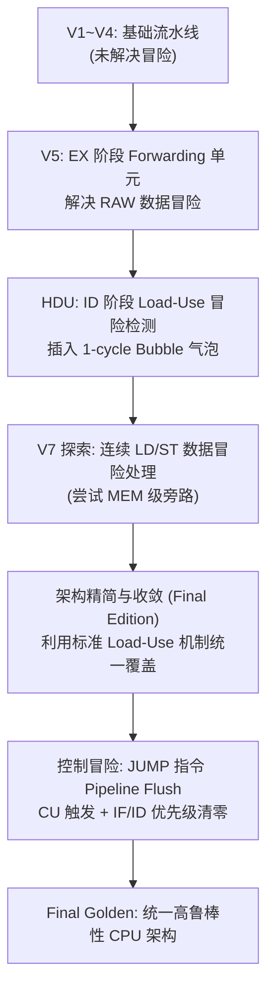

# 16-Bit RISC CPU 流水线架构设计与演进历程 (Architecture Evolution)

本项目记录了一个经典 5 级流水线（IF-ID-EX-MEM-WB）16-Bit RISC CPU 从基础单周期/无冒险流水线逐步迭代演进至支持全功能冒险处理（Data Hazards Forwarding, Load-Use Stall, Jump Flush）的完整工程生命周期。

---

## 1. 架构总览 (Architecture Overview)

* **字长与寄存器**: 16-bit 架构，包含 4 个通用寄存器（`R0` ~ `R3`）。
* **指令格式**: 固定 16-bit 长度，分为四个字段：
  * `[15:12]` **Opcode** (4-bit): 操作码
  * `[11:10]` **Rd** (2-bit): 目的寄存器 / 源操作数 1
  * `[9:8]`   **Rs** (2-bit): 源操作数 2
  * `[7:0]`   **Imm / Offset** (8-bit): 8 位立即数或访存偏移量
* **五级流水线划分**:
  1. **IF (Instruction Fetch)**: 取指，PC 寄存器更新，指令内存读取。
  2. **ID (Instruction Decode)**: 译码，寄存器堆读取，控制单元生成信号，冒险检测单元 (HDU)。
  3. **EX (Execute)**: 算术逻辑运算 / 访存有效地址计算，前推单元 (Forwarding Unit)。
  4. **MEM (Memory Access)**: 数据内存读写。
  5. **WB (Write Back)**: 结果写回寄存器堆。

---

## 2. 演进历程与设计决策 (Evolution Journey)



---

### Phase 1: V5 阶段 —— Forwarding 旁路与数据冒险消除

#### 1.1 核心问题 (RAW Hazard)
在流水线中，后序指令在 EX 阶段需要使用前序指令在 EX 或 MEM 阶段计算得到的值，而此时该值尚未写回到寄存器堆（Write-Back 在第 5 周期发生），产生经典的 Read-After-Write (RAW) 冒险。

#### 1.2 Forwarding Unit 逻辑设计
* **部署位置**: EX 阶段。
* **输出控制信号**: `ForwardA[1:0]` 与 `ForwardB[1:0]`，分别控制 `MUX_A_fwd` 与 `MUX_B_fwd` 两个 3-to-1 MUX。
* **对称比较逻辑**:
  * `ForwardA`: 比较 `ID/EX.Rd_addr` 是否匹配 `EX/MEM.Rd_addr` 或 `MEM/WB.Rd_addr`。
  * `ForwardB`: 比较 `ID/EX.Rs_addr` 是否匹配 `EX/MEM.Rd_addr` 或 `MEM/WB.Rd_addr`。
* **优先级与使能条件**:
  * `EX/MEM` 阶段的结果比 `MEM/WB` 更“新鲜”，因此 **`EX/MEM` 优先于 `MEM/WB`**。
  * 前提条件: 被比较方的写使能信号 `RegWrite == 1`。

#### 1.3 立即数与 Forwarding 的两级级联结构
每条操作数路径采用两级 MUX 级联：
1. **第一级 (3-to-1 MUX)**: 负责寄存器值与 Forwarding 前推数据的仲裁（受 `Forwarding Unit` 控制）。
2. **第二级 (2-to-1 MUX)**: 在前推结果与立即数 `Imm` 之间选择（受 `ALUASrc` / `ALUSrc` 控制）。
> **设计优势**: 两者完全正交。当指令使用立即数时（如 `add Rd, #imm`），`ALUSrc` 选通 `Imm`，第一级 Forwarding 结果被自然忽略，硬件控制极为简洁。

---

### Phase 2: Hazard Detection Unit (HDU) —— Load-Use 冒险解决

#### 2.1 物理约束
`ld Rd, Rs, #off` 指令的目标数据必须在 **MEM 阶段末尾** 才能从 Data Memory 读出。若紧随其后的指令在 EX 阶段就需要该数据，数据无法“逆时间倒流”前推。

#### 2.2 检测与停顿逻辑 (1-Cycle Bubble Stall)
* **部署位置**: ID 阶段。
* **检测条件**:
  $$\text{ID/EX.MemRead} == 1 \quad\land\quad (\text{ID/EX.Rd\_addr} == \text{IF/ID.Rd\_addr} \;\lor\; \text{ID/EX.Rd\_addr} == \text{IF/ID.Rs\_addr})$$
* **执行动作 (插入气泡 Bubble)**:
  1. **冻结 PC**: `PC_Write = 0`，PC 保持当前值不变。
  2. **冻结 IF/ID**: `IF_ID_Write = 0`，保留当前正在译码的指令，下周期重新译码。
  3. **清零 ID/EX 控制信号**: `ID_EX_Bubble = 1`，将进入 EX 阶段的控制信号全部置 0（等效于执行一个空指令 NOP）。

经过 1 个周期的 Stall 后，`ld` 指令已推进至 MEM/WB 阶段，随后的指令即可通过标准的 Forwarding Unit 从 MEM/WB 阶段顺利拿到数据！

---

### Phase 3: V7 探索与最终精简决策 (Load-to-Store Hazard Trade-off)

#### 3.1 连续 LD / ST 场景分析
考虑以下连续指令序列：
```assembly
ld R0, R1, #0    ; R0 <- Mem[R1 + 0]
st R2, R0, #0    ; Mem[R0 + 0] <- R2 (或 st R0, R2, #0: Mem[R2] <- R0)
```

#### 3.2 V7 阶段的尝试
* V7 曾尝试在 `ForwardB` 中额外增加特化逻辑：若 MEM 阶段的 `MemRead` 信号为真且地址匹配，`MUX_B_fwd` 直接抓取 MEM 阶段读出的数据。

#### 3.3 最终版架构精简 (Final Decision)
* **深入分析**:
  对于需要读取 `R0` 的 `st` 指令，由于 `ld` 属于内存读取操作，在译码阶段 **HDU 的 Load-Use 检测逻辑** 已经精准识别到了 `ID/EX.MemRead == 1` 且目标寄存器与 `st` 的源寄存器重合。
* **精简优势**:
  HDU 自动触发的 1 个周期 Bubble Stall 已经使 `ld` 进入 MEM/WB 阶段；进入 EX 阶段的 `st` 直接复用成熟的 `MEM/WB -> EX` 前推路径即可。
* **结论**:
  **删除了 V7 的特化复杂逻辑**，避免了在关键路径上增加额外的多路选择延迟，保持了数据通路的纯粹性与高频特性。

---

### Phase 4: Control Hazard —— Jump 指令与流水线 Flush

#### 4.1 核心问题
当 `jump #imm` 指令进入 ID 阶段并完成译码计算目标地址时，IF 阶段已经根据 $PC+1$ 预取了一条错误的顺序指令放入了 `IF/ID` 寄存器。

#### 4.2 三处关键改造
1. **CU → HDU 联动**:
   控制单元在 ID 阶段译码出 `JUMP` 指令时，拉高 `Jump` 信号线。
2. **HDU → IF/ID 控制线**:
   HDU 产生 `IF_ID_Flush` 信号，与原有 `IF_ID_Write` 信号并列送入 `IF/ID` 寄存器。
3. **IF/ID 寄存器优先级改造**:
   $$\text{Priority}: \text{Flush} > \text{Write}$$
   * 当 `Flush == 1` 时：无条件清零寄存器输出（写入 NOP），清空预取的无效指令。
   * 当 `Flush == 0` 且 `Write == 0` 时：保持原值（Stall）。
   * 其余情况：正常锁存下一指令。

PC 端则通过 `MUX_PC` 在 ID 阶段直接切换到跳转目标，被清除的指令形成 1 个气泡，完美消除了分支控制冒险。

---

## 3. 冒险解决矩阵汇总 (Hazard Resolution Matrix)

| 冒险类型 | 触发场景 | 硬件处理单元 | 硬件处理动作 | 性能代价 |
| :--- | :--- | :--- | :--- | :--- |
| **RAW 数据冒险** (ALU-to-ALU) | 前序算术指令，后序算术/逻辑指令依赖其结果 | **Forwarding Unit (EX)** | `EX/MEM` 或 `MEM/WB` 数据直接前推至 ALU 输入端 | **0 周期** (无损) |
| **Load-Use 数据冒险** | `ld` 指令紧跟使用其加载结果的算术/逻辑/存数指令 | **HDU (ID)** + **Forwarding Unit** | HDU 冻结 PC 与 IF/ID 1 周期并向 ID/EX 注入气泡；随后通过 Forwarding 取数 | **1 周期** Stall |
| **控制冒险 (Jump)** | 执行无条件跳转 `jump #imm` | **CU** + **HDU** + **IF/ID Reg** | `IF_ID_Flush` 将错误预取指令替换为 NOP，PC 更新为 Jump Target | **1 周期** Flush |
| **RAW 存数冒险** (Store Data) | 寄存器刚被算术指令计算，随后被 `st` 存入内存 | **Forwarding Unit (EX)** | 前推的 `Rd` 数据直接送入 `EX_MEM.store_data` | **0 周期** (无损) |

---

## 4. 最终验证与波形 (Verification & Waveform)

基于 Vivado / ModelSim 平台对全场景流水线行为进行了严格的时序与逻辑仿真验证：


* **PC 连续追踪**: 验证了在 50MHz 时钟下，指令流水线的取指、停顿与跳转序列。
* **寄存器堆状态收敛**:
  * 测试程序最终正确计算出 `R0 = 8`, `R1 = 3`, `R2 = 8`, `R3 = 7`。
  * 完美验证了 Forwarding 单元、HDU 停顿机制及 Jump Flush 的正确性。
