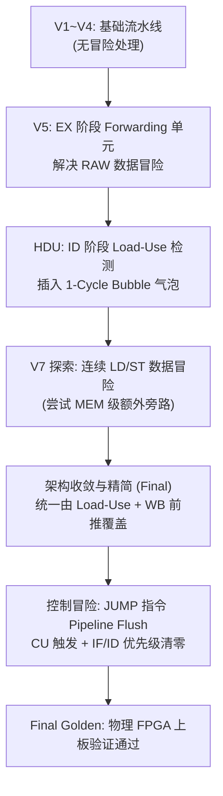

# 16-Bit RISC CPU 流水线架构设计与演进报告 (Architecture Evolution Report)

> **Academic Reference**:  
> *Computer Organization and Design RISC-V Edition: The Hardware Software Interface*  
> by **David A. Patterson** and **John L. Hennessy** (The Morgan Kaufmann Series in Computer Architecture and Design).  
>
> **Project Context**:  
> University of Electronic Science and Technology of China (UESTC)  
> Course: *Digital Logical Design and Application* (Team 202602: 徐瑞成, 李泊良, 刘颢诚)

---

## 1. 架构总览与规范 (Architecture Specification)

本项目设计并实现了一个基于 **5 级流水线（IF-ID-EX-MEM-WB）** 的 **16-Bit RISC 处理器**，并在 **EES-331 FPGA 开发板（Xilinx Zynq XC7Z020）** 上完成了 100MHz 时钟下的物理硬件验证。

```
 15       12 11     10 9       8 7                            0
+-----------+---------+---------+------------------------------+
|   Opcode  |   Rd    |   Rs    |          Imm / Offset        |
|  (4 bits) | (2 bits)| (2 bits)|            (8 bits)          |
+-----------+---------+---------+------------------------------+
```

### 1.1 五级流水线职责划分
1. **IF (Instruction Fetch)**: 程序计数器（PC）输出地址至指令存储器读取 16 位机器码，专用加法器并行计算 $PC+1$。
2. **ID (Instruction Decode)**: 控制单元解码 4-bit Opcode；寄存器堆读取两路源操作数；立即数完成 16 位扩展；冒险检测单元（HDU）评估 Load-Use 与 Jump 状态。
3. **EX (Execute)**: 前推单元（Forwarding Unit）仲裁操作数来源；两级 MUX 级联选通；ALU 执行算术/逻辑/有效地址计算。
4. **MEM (Memory Access)**: 数据存储器根据 ALU 输出地址进行读写。
5. **WB (Write Back)**: MUX_WB 仲裁内存读出数据与 ALU 运算结果，写回目标寄存器，并回传至 Forwarding Unit。

---

## 2. 演进历程与设计决策 (Evolution Journey)



---

### Phase 1: V5 阶段 —— Forwarding 旁路与数据冒险消除

#### 1.1 核心问题 (RAW Hazard)
在流水线中，后序指令在 EX 阶段需要使用前序指令在 EX 或 MEM 阶段计算得到的值，而此时该值尚未写回到寄存器堆（Write-Back 在第 5 周期发生），产生经典的 Read-After-Write (RAW) 冒险。

#### 1.2 Forwarding Unit 逻辑设计
* **部署位置**: EX 阶段。
* **输出控制信号**: `ForwardA[1:0]` 与 `ForwardB[1:0]`，分别控制 `MUX_A_fwd` 与 `MUX_B_fwd` 两个 3-to-1 MUX。
* **对称比较逻辑**:
  * `ForwardA`: 比较 `ID/EX.Rd_addr` 是否匹配 `EX/MEM.Rd_addr` 或 `MEM/WB.Rd_addr`。
  * `ForwardB`: 比较 `ID/EX.Rs_addr` 是否匹配 `EX/MEM.Rd_addr` 或 `MEM/WB.Rd_addr`。
* **优先级与使能条件**:
  * `EX/MEM` 阶段的结果比 `MEM/WB` 更“新鲜”，因此 **`EX/MEM` 优先于 `MEM/WB`**。
  * 前提条件: 被比较方的写使能信号 `RegWrite == 1`。

#### 1.3 立即数与 Forwarding 的两级级联结构
每条操作数路径采用两级 MUX 级联：
1. **第一级 (3-to-1 MUX)**: 负责寄存器值与 Forwarding 前推数据的仲裁（受 `Forwarding Unit` 控制）。
2. **第二级 (2-to-1 MUX)**: 在前推结果与立即数 `Imm` 之间选择（受 `ALUASrc` / `ALUSrc` 控制）。
> **设计优势**: 两者完全正交。当指令使用立即数时（如 `add Rd, #imm`），`ALUSrc` 选通 `Imm`，第一级 Forwarding 结果被自然忽略，硬件控制极为简洁。

---

### Phase 2: Hazard Detection Unit (HDU) —— Load-Use 冒险解决

#### 2.1 物理约束
`ld Rd, Rs, #off` 指令的目标数据必须在 **MEM 阶段末尾** 才能从 Data Memory 读出。若紧随其后的指令在 EX 阶段就需要该数据，数据无法“逆时间倒流”前推。

#### 2.2 检测与停顿逻辑 (1-Cycle Bubble Stall)
* **部署位置**: ID 阶段。
* **检测条件**:
  $$\text{ID/EX.MemRead} == 1 \quad\land\quad (\text{ID/EX.Rd\_addr} == \text{IF/ID.Rd\_addr} \;\lor\; \text{ID/EX.Rd\_addr} == \text{IF/ID.Rs\_addr})$$
* **执行动作 (插入气泡 Bubble)**:
  1. **冻结 PC**: `PC_Write = 0`，PC 保持当前值不变。
  2. **冻结 IF/ID**: `IF_ID_Write = 0`，保留当前正在译码的指令，下周期重新译码。
  3. **清零 ID/EX 控制信号**: `ID_EX_Flush = 1`，将进入 EX 阶段的控制信号全部置 0（等效于执行一个空指令 NOP）。

经过 1 个周期的 Stall 后，`ld` 指令已推进至 MEM/WB 阶段，随后的指令即可通过标准的 Forwarding Unit 从 MEM/WB 阶段顺利拿到数据！

---

### Phase 3: V7 探索与最终精简决策 (Load-to-Store Hazard Trade-off)

#### 3.1 连续 LD / ST 场景分析
考虑以下连续指令序列：
```assembly
ld R0, R1, #0    ; R0 <- Mem[R1 + 0]
st R2, R0, #0    ; Mem[R0 + 0] <- R2
```

#### 3.2 V7 阶段的尝试
* V7 曾尝试在 `ForwardB` 中额外增加特化逻辑：若 MEM 阶段的 `MemRead` 信号为真且地址匹配，`MUX_B_fwd` 直接抓取 MEM 阶段读出的数据。

#### 3.3 最终版架构精简 (Final Decision)
* **深入分析**:
  对于需要读取 `R0` 的 `st` 指令，由于 `ld` 属于内存读取操作，在译码阶段 **HDU 的 Load-Use 检测逻辑** 已经精准识别到了 `ID/EX.MemRead == 1` 且目标寄存器与 `st` 的源寄存器重合。
* **精简优势**:
  HDU 自动触发的 1 个周期 Bubble Stall 已经使 `ld` 进入 MEM/WB 阶段；进入 EX 阶段的 `st` 直接复用成熟的 `MEM/WB -> EX` 前推路径即可。
* **结论**:
  **删除了 V7 的特化复杂逻辑**，避免了在关键路径上增加额外的多路选择延迟，保持了数据通路的纯粹性与高频特性。

---

### Phase 4: Control Hazard —— Jump 指令与流水线 Flush

#### 4.1 核心问题
当 `jump #imm` 指令进入 ID 阶段并完成译码计算目标地址时，IF 阶段已经根据 $PC+1$ 预取了一条错误的顺序指令放入了 `IF/ID` 寄存器。

#### 4.2 三处关键改造
1. **CU → HDU 联动**:
   控制单元在 ID 阶段译码出 `JUMP` 指令时，拉高 `Jump` 信号线。
2. **HDU → IF/ID 控制线**:
   HDU 产生 `IF_ID_Flush` 信号，与原有 `IF_ID_Write` 信号并列送入 `IF/ID` 寄存器。
3. **IF/ID 寄存器优先级改造**:
   $$\text{Priority}: \text{Flush} > \text{Write}$$
   * 当 `Flush == 1` 时：无条件清零寄存器输出（写入 NOP），清空预取的无效指令。
   * 当 `Flush == 0` 且 `Write == 0` 时：保持原值（Stall）。
   * 其余情况：正常锁存下一指令。

PC 端则通过 `MUX_PC` 在 ID 阶段直接切换到跳转目标，被清除的指令形成 1 个气泡，完美消除了分支控制冒险。

---

## 3. 硬件实现与 FPGA 板级适配细节

### 3.1 100MHz 单时钟与时序收敛
* 绑定外部物理引脚 `M19`，流水线寄存器与寄存器堆统一在 `clk` 上升沿触发。
* 16-bit 组合逻辑关键路径深度经过优化，后综合时序分析（Post-Implementation Timing）无 Setup/Hold 违例。

### 3.2 板载按键极性转换 (Reset Polarity Compensation)
* EES-331 开发板上的复位按键 S1 外接 3.3V 上拉电阻，默认高电平，按下为低电平。
* 在 `cpu_top` 顶层统一进行单点极性取反：`rst_n = ~rst`，确保系统上电即处于工作状态，按下 S1 触发同步清零。

### 3.3 板载 LED 硬件可观测性设计
* 在 `reg_file.v` 中引出 `reg0_out` 与 `reg1_out` 专用输出端口。
* 顶层将 `led[7:0]` 映射为 `{R0[3:0], R1[3:0]}`，使用 8 个 LED 同步实时观测两个核心通用寄存器的低 4 位状态。

---

## 4. 冒险基准测试集 (Benchmark Verification)

| 测试类型 | 指令测试序列 | 目标验证机制 | 预期结果与硬件观测 |
| :--- | :--- | :--- | :--- |
| **Forwarding (RAW)** | `add R0,#3`<br/>`add R0,#4` | EX 阶段旁路前推（无停顿） | **$R0 = 7$**，ALU 直接获取 EX/MEM 最新计算值 |
| **Load-Use Stall** | `st R0,R1,#0`<br/>`ld R2,R1,#0`<br/>`mov R3,#1`<br/>`add R2,R3` | HDU 注入 1-Cycle Bubble | **$R2$ 正确读出内存值**，流水线精准停顿 1 周期 |
| **Jump Flush** | `mov R0,#5`<br/>`jmp 3`<br/>`mov R0,#99`<br/>`mov R1,#7` | IF/ID 寄存器硬件冲刷 (Flush) | **$R0 = 5, R1 = 7$**（`mov R0,#99` 被冲刷为 NOP，LED 实时显示一致） |
